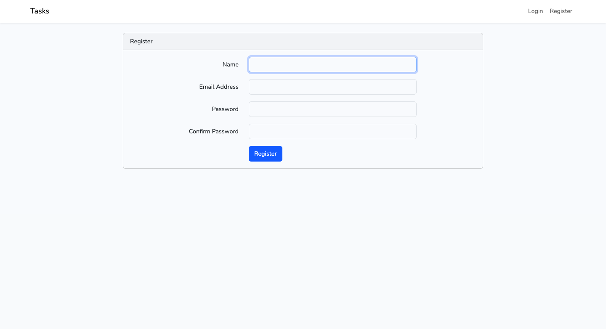
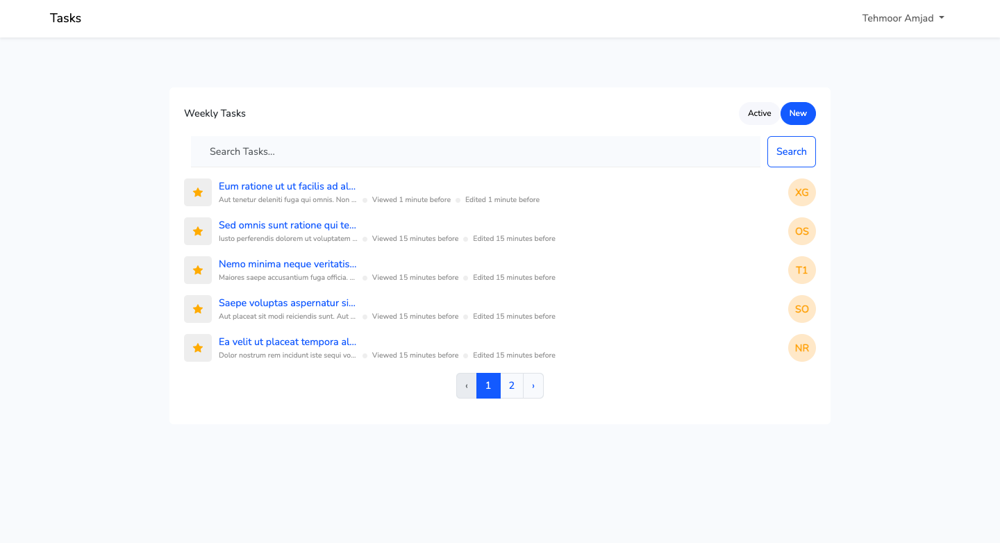
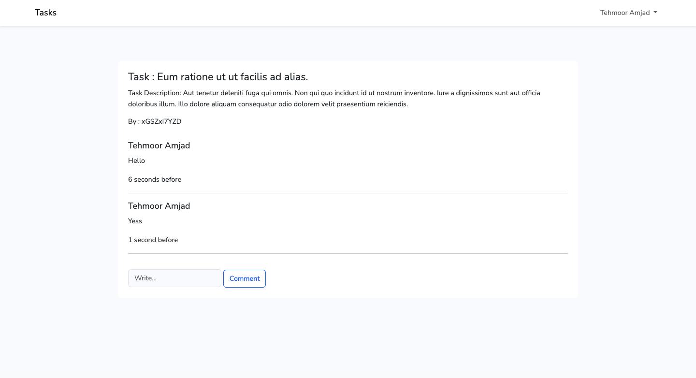
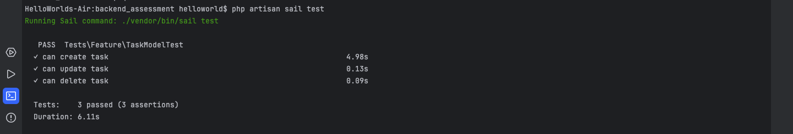

# Backend ASSESSMENT Test

# For Front End:
Just Run npm install and then npm run dev

# For Backend Server:

# For alias:
alias sail='bash vendor/bin/sail'

# To Start Server:
  sail up
# To Stop Server: 
  sail stop

# To Run migrations: 
  sail artisan migrate

# To Seed Tasks Data, Run Task Seeder:
  sail artisan db:seed --class=TaskSeeder

# To run test cases:
  First run server using : sail up
  Then run : sail test

Atfer running server, You may register and then login.
After login, you will see tasks saved by seeders. and then you can click on each task to create comments. 
Pagination and searching is added in tasks also.

# Screen shots

# Login

# Tasks

# Comments

# TestCase

